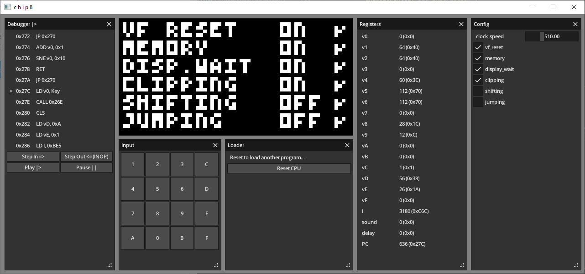

# CHIP8-Debugger

Fully fledged Chip-8 emulator and debugger to evaluate the [Odin language](https://odin-lang.org/).

Everything uses the core and vendor libraries included with the language (microui and sdl2) :)

